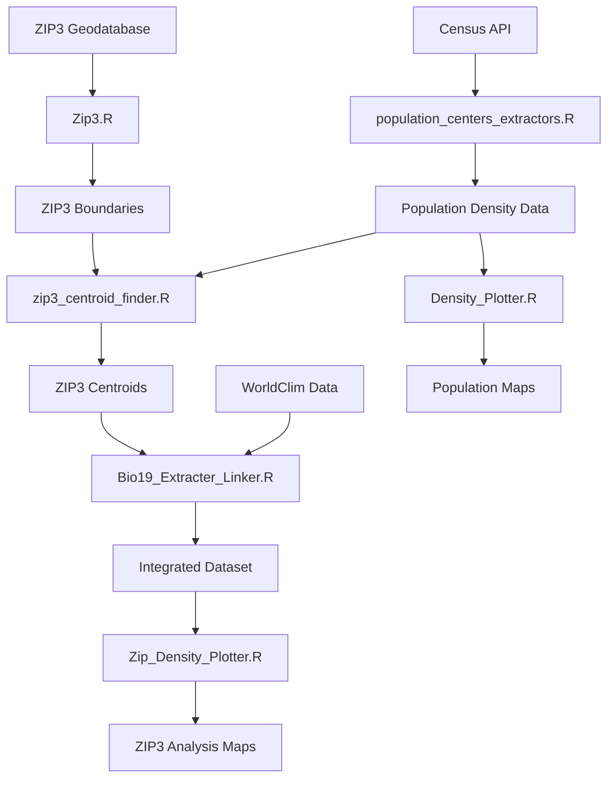

# Geo_Climate_PCA

A comprehensive geospatial analysis project that integrates US geographic boundaries, population density data, and bioclimatic variables through Principal Component Analysis (PCA). This project creates a unified dataset linking ZIP3 regions with demographic and climate characteristics for spatial analysis and modeling.

## 🌍 Project Overview

This project combines multiple data sources to create a rich geospatial dataset:

- **Geographic Boundaries**: US ZIP3 (3-digit ZIP code) regions
- **Population Data**: Census tract-level population density from the American Community Survey
- **Climate Data**: WorldClim bioclimatic variables (19 variables including temperature and precipitation metrics)
- **Spatial Analysis**: Geometric and population-weighted centroids for each ZIP3 region
- **Dimensionality Reduction**: PCA analysis on climate variables to identify key environmental gradients

## 📋 Table of Contents

- [Features](#-features)
- [Installation](#-installation)
- [Data Sources](#-data-sources)
- [Usage](#-usage)
- [Scripts Overview](#-scripts-overview)
- [Outputs](#-outputs)
- [Workflow](#-workflow)
- [Examples](#-examples)
- [Contributing](#-contributing)
- [License](#-license)

## ✨ Features

- **Multi-source Data Integration**: Seamlessly combines geographic, demographic, and climate data
- **Automated Data Processing**: Scripts handle downloading, processing, and validation of large datasets
- **Advanced Spatial Analysis**: Calculates both geometric and population-weighted centroids
- **Climate PCA**: Reduces 19 bioclimatic variables to principal components for analysis
- **Comprehensive Visualization**: Generates maps and plots for data validation and exploration
- **Reproducible Workflow**: Uses `renv` for package management and version control

## 🛠 Installation

### Prerequisites

- **R** (version 4.0 or higher)
- **RStudio** (recommended)
- **US Census API Key** (free registration required)

### Setup

1. **Clone the repository:**
   ```bash
   git clone https://github.com/integraloftheday/Geo_Climate_PCA.git
   cd Geo_Climate_PCA
   ```

2. **Install R packages using renv:**
   ```r
   # Open R/RStudio in the project directory
   renv::restore()
   ```

3. **Get a Census API Key:**
   - Register at: https://api.census.gov/data/key_signup.html
   - Add your key to `population_centers_extractors.R` (uncomment and modify line 24)

### Required R Packages

The project uses these main packages (managed via `renv`):
- `sf` - Spatial data handling
- `terra` - Raster data processing  
- `dplyr` - Data manipulation
- `ggplot2` - Data visualization
- `tidycensus` - Census data access
- `geodata` - Geographic data download
- `WorldClimData` - Climate data access
- `viridis` - Color palettes
- `purrr` - Functional programming

## 📊 Data Sources

### Geographic Data
- **ZIP3 Boundaries**: Local geodatabase files (`.gdb` format)
- **Coverage**: Continental United States (CONUS)

### Population Data  
- **Source**: US Census Bureau via `tidycensus`
- **Dataset**: American Community Survey (ACS) 2018-2022 5-year estimates
- **Resolution**: Census tract level
- **Variables**: Total population, geographic area, population density

### Climate Data
- **Source**: WorldClim (www.worldclim.org)
- **Variables**: 19 bioclimatic variables
- **Resolution**: 2.5 arc-minutes (~4.5 km at equator)
- **Period**: Current conditions (1970-2000 average)

#### Bioclimatic Variables
- BIO1: Annual Mean Temperature
- BIO2: Mean Diurnal Range  
- BIO3: Isothermality
- BIO4: Temperature Seasonality
- BIO5: Max Temperature of Warmest Month
- BIO6: Min Temperature of Coldest Month
- BIO7: Temperature Annual Range
- BIO8: Mean Temperature of Wettest Quarter
- BIO9: Mean Temperature of Driest Quarter
- BIO10: Mean Temperature of Warmest Quarter
- BIO11: Mean Temperature of Coldest Quarter
- BIO12: Annual Precipitation
- BIO13: Precipitation of Wettest Month
- BIO14: Precipitation of Driest Month
- BIO15: Precipitation Seasonality
- BIO16: Precipitation of Wettest Quarter
- BIO17: Precipitation of Driest Quarter
- BIO18: Precipitation of Warmest Quarter
- BIO19: Precipitation of Coldest Quarter

## 🚀 Usage

### Basic Workflow

Run the scripts in this order for a complete analysis:

```r
# 1. Download and process population data
source("population_centers_extractors.R")

# 2. Process ZIP3 boundary data  
source("Zip3.R")

# 3. Calculate ZIP3 centroids
source("zip3_centroid_finder.R")

# 4. Download climate data and perform PCA
source("Bio19_Extracter_Linker.R")

# 5. Create visualizations
source("Density_Plotter.R")
source("Zip_Density_Plotter.R")
```

### Quick Start Example

```r
# Load required libraries
library(sf)
library(dplyr)
library(ggplot2)

# Read the final integrated dataset
climate_data <- read.csv("data_export/zip3_centroids_climate.csv")

# Basic summary
summary(climate_data)

# Plot first two principal components
ggplot(climate_data, aes(x = PC1, y = PC2, color = centroid_type)) +
  geom_point(alpha = 0.6) +
  theme_minimal() +
  labs(title = "Climate PCA: First Two Components by Centroid Type")
```

## 📁 Scripts Overview

### Core Processing Scripts

#### `population_centers_extractors.R`
**Purpose**: Downloads and processes US Census tract population data
- Downloads tract-level population data for all US states
- Calculates population density (people per km²)
- Transforms to consistent projection (Albers Equal Area)
- **Output**: `us_tracts_population_density_2022.gpkg`

#### `Zip3.R`  
**Purpose**: Processes ZIP3 boundary data from geodatabase files
- Reads ZIP3 boundaries from local `.gdb` files
- Handles geometry column naming issues
- Creates validation maps
- **Output**: `us_zip3_boundaries.gpkg`

#### `zip3_centroid_finder.R`
**Purpose**: Calculates centroids for each ZIP3 region
- Computes geometric centroids (geographic center)
- Calculates population-weighted centroids (demographic center)
- Creates individual maps for each ZIP3
- **Output**: `zip3_all_centroids.gpkg`, individual PNG maps

#### `Bio19_Extracter_Linker.R`
**Purpose**: Climate data processing and PCA analysis
- Downloads WorldClim bioclimatic data
- Performs PCA on climate variables
- Extracts climate values for ZIP3 centroids
- **Output**: `zip3_centroids_with_bioclim_pca_GRID.gpkg`, `zip3_centroids_climate.csv`

### Visualization Scripts

#### `Density_Plotter.R`
**Purpose**: Creates US population density maps
- Generates log-scale density visualizations
- Uses colorblind-friendly palettes
- **Output**: `us_tracts_density_map.png`

#### `Zip_Density_Plotter.R`
**Purpose**: Creates ZIP3-specific density visualizations
- Overlays ZIP3 boundaries on population density
- Focuses on specific regions (e.g., California)
- **Output**: Regional density maps

## 📈 Outputs

### Data Files

#### GeoPackage Files (`.gpkg`)
- `us_tracts_population_density_2022.gpkg` - Census tract population data
- `us_zip3_boundaries.gpkg` - ZIP3 boundary polygons  
- `zip3_conus.gpkg` - ZIP3 regions intersected with population data
- `zip3_all_centroids.gpkg` - Calculated centroids for each ZIP3
- `zip3_centroids_with_bioclim_pca_GRID.gpkg` - Final integrated dataset

#### CSV Files
- `zip3_centroids_climate.csv` - Climate data and PCA scores for ZIP3 centroids

### Visualizations

#### Maps (`.png`)
- `us_tracts_density_map.png` - National population density map
- `zip3_validation_*.png` - ZIP3 boundary validation maps
- Individual ZIP3 maps in `data/Zip3_Population_Maps/`

## 🔄 Workflow



## 📊 Examples

### Data Structure

The final integrated dataset contains:

```r
# Example structure of zip3_centroids_climate.csv
str(climate_data)
# 'data.frame': 1000+ obs. of 33+ variables:
#  $ ZIP3                    : chr  "000" "001" "010" ...
#  $ centroid_type          : chr  "Geometric" "Population-Weighted" ...
#  $ wc2.1_2.5m_bio_1      : num  6.74 11.31 6.87 ...  # Annual Mean Temperature
#  $ wc2.1_2.5m_bio_12     : num  330 322 1013 ...      # Annual Precipitation  
#  $ PC1                    : num  -0.729 0.321 -1.096 ... # First Principal Component
#  $ PC2                    : num  1.982 3.327 -3.029 ... # Second Principal Component
#  $ longitude              : num  -111 -105 -81 ...
#  $ latitude               : num  39.7 38.2 45.5 ...
```

### Sample Analysis

```r
# Load the data
data <- read.csv("data_export/zip3_centroids_climate.csv")

# Climate diversity analysis
library(ggplot2)

# Plot temperature vs precipitation with PCA coloring
ggplot(data, aes(x = wc2.1_2.5m_bio_1, y = wc2.1_2.5m_bio_12, color = PC1)) +
  geom_point(alpha = 0.7) +
  scale_color_viridis_c() +
  labs(
    x = "Annual Mean Temperature (°C)",
    y = "Annual Precipitation (mm)", 
    color = "Climate PC1",
    title = "US ZIP3 Climate Diversity"
  ) +
  theme_minimal()
```

## 🤝 Contributing

Contributions are welcome! Please consider:

1. **Issues**: Report bugs or suggest enhancements
2. **Pull Requests**: Submit improvements or new features
3. **Documentation**: Help improve documentation and examples
4. **Data Sources**: Suggest additional data sources or variables

### Development Guidelines

- Follow existing code style and commenting patterns
- Test scripts with sample data before submitting
- Update documentation for new features
- Use descriptive commit messages

## 📝 License

This project is available under the MIT License. See LICENSE file for details.

## 🙏 Acknowledgments

- **US Census Bureau** for population data access
- **WorldClim** for climate data
- **R Community** for excellent spatial analysis packages
- **tidycensus** package maintainers for simplified Census data access

## 📞 Support

For questions, issues, or suggestions:
- Open an issue on GitHub
- Check existing documentation and examples
- Review script comments for implementation details

---

*This project demonstrates the power of integrating multiple geospatial data sources for comprehensive environmental and demographic analysis.*